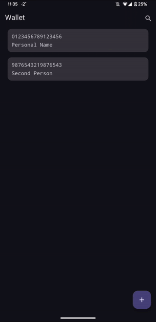

📱 **Wallet**

Welcome to Wallet - the ultimate Android application for securely storing your credit and debit card information! 🛡️
### Demo

### Purpose
Wallet is designed to help you conveniently and securely store essential details about your credit and debit cards, ensuring easy access to this information whenever you need it. Whether you want to quickly view your card details or securely store backup information for your cards, Wallet has got you covered. 💳💻

### Features
- **Easy Access:** Quickly access stored card information when needed.
- **Backup Capability:** Maintain a secure backup of your card details for peace of mind.
- **User-Friendly Interface:** Intuitive design for effortless navigation and usage.
- **Customization Options:** Personalize your card entries with custom labels or categories.

### Installation
1. Download the Wallet APK file from our official website.
2. Enable installation from unknown sources in your device settings.
3. Install the APK file on your Android device.
4. Launch the Wallet app and start securely storing your card details.

### Security
- Wallet prioritizes the security and privacy of your data.
- All stored info rmation is encrypted to prevent unauthorized access.
- We do not store any of your data on external servers to maintain confidentiality.

